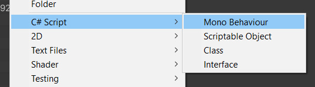

# Unity Script Templates
My default C# script templates for Unity.

# How do I use it?
For each project must be placed at

    "Assets/ScriptTemplates/"

Or to change for each unity version must be placed at

    "D:/Program Files/Unity/Editor/2019.4.20f1/Editor/Data/Resources/ScriptTemplates/"
*(Full path can be different depending on where you've installed unity and which version you're using)*